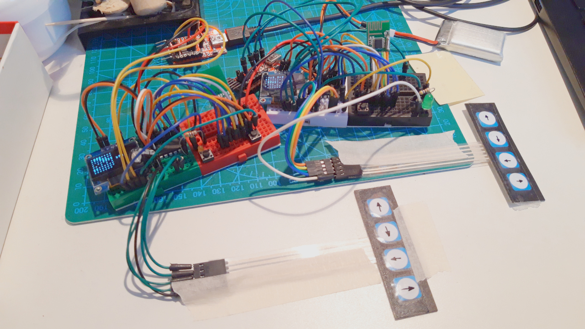

# afflopro2-duino
Affonda la Flotta per 2 Arduino connessi via radio (battleship game on two Arduinos)

Affonda la Flotta
Battaglia Navale
Battleship
Sink the Fleet

<p align="center">
  
</p>

## ABOUT:
I'm the Sink the Fleet videogame played on two microcontrollers, one for each player.

You can use 4 hardware normally open push buttons for inputs.
The battlefield is showed on a 128x64 pixels OLED display.

## HARDWARE:
for each player (X2)

(mandatory)
- microcontroller (ATMEGA328)
- display 128x64  (SSD1306 or others supported by U8X8 library)
- radio           (LT8900)
- 5 buttons       (any N.O. button)

## USER INTERFACE:
A very simple interface:
- `GO`    = ok / fire!
- `UP`    = move the cursor
- `DOWN`  = move the cursor
- `LEFT`  = move the cursor
- `RIGHT` = move the cursor

## CONNECTIONS:

 ### Arduino -> LT8900
```
 GND        GND
 3v3        VCC
 8          PKT
 9          CS
 10         RST
 11         MOSI
 12         MISO
 13         SCK
 ```
 
 ### Player-1 (sender) or Player-2 (receiver):
 - Connect `PIN_ROLE` to ground for sender, leave open for receiver role.
 
 ### BUTTONS:
 ```
define SU 6     //btn move UP
define GIU 5    //btn move DOWN
define SIN 4    //btn move LEFT
define DST 3    //btn move RIGHT
define GO 2     //btn GO - FIRE
```
